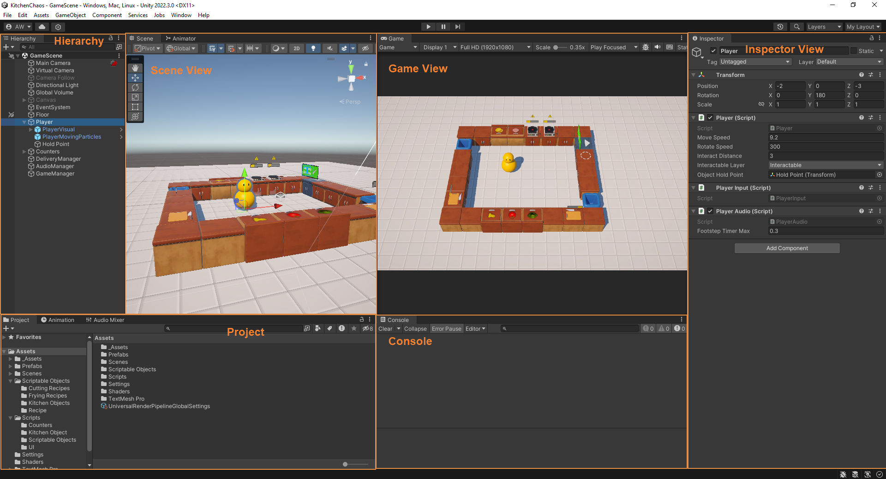

Unity adalah cross-platform game engine yang dirilis pada tahun 2005 oleh Unity Technologies. Unity berfokus pada 
pengembangan game 2D, 3D dan juga Software Interaktif. Unity sekarang sudah mendukung lebih dari 20 target platform 
yang berbeda, dengan platform yang paling populer yaitu PC, Android, iOS.

## Pengenalan Cara Kerja Unity*

Di Unity, semua Gameplay berlangsung di dalam ***Scene***. Scene merupakan suatu *Container* 
di mana mencangkup berbagai aspek di dalam game, seperti Game Level, Title Screen, Camera, GameUI,
Cut Scene, dll. Di dalam Scene terdapat berbagai Object yang disebut sebagai Game Object. 

**Game Object** merupakan object yang ada dalam sebuah Scene. Game Object dapat berupa apa saja 
mulai dari 3D Model, Sprite Image, Camera, Menu GUI di layar, sampai yang tidak terlihat sekalipun 
seperti Audio Manager. Setiap game object memiliki sekumpulan component di dalamnya.

**Component** adalah bagian dari game object yang menentukan *behavior* (perilaku) game object 
tersebut di dalam Scene, termasuk bagaimana beraksi terhadap game object lain.

Setiap component di unity merupakan keturunan (derive) dari class mono behavior. 
Dalam mono behavior terdapat build in functions yang umum dipakai seperti 
**Awake**, **Start**, **Update**, **FixedUpdate**, **OnEnable**, **OnDisable**, **OnDestroy**.

- **Awake** - Dipanggil sebelum Start saat component terbangun.
- **Start** - Dipanggil setelah Awake saat component memulai.
- **Update** - Dipanggil setiap frame mengikuti frame rate yang ada.
- **FixedUpdate** - Dipanggil setiap beberapa rentang waktu yang sama / konsisten.
- **OnEnable** - Dipanggil ketika component diaktifkan waktu meng-check toggle di component inspector.
- **OnDisable** - Dipanggil ketika component dimatikan waktu meng-un toggle di component inspector.
- **OnDestroy** - Dipanggil ketika game object yang menjadi tempat component tersebut dihancurkan. 

## Pengenalan Layout Unity

Unity menyediakan antarmuka visual yang bisa diatur sesuai keinginan. Berikut penjelasan dari setiap bagian antarmuka unity :

- **Hierarchy** - Menampilkan daftar semua objek yang ada dalam Scene. Objek ditampilkan dalam struktur hierarki (parent-child).
- **Scene View** - Menampilkan area kerja di mana Anda dapat menempatkan dan mengatur objek dalam ruang 3D maupun 2D. 
- **Game View** - Menampilkan tampilan akhir seperti yang akan dilihat oleh pemain. Berguna untuk menguji game dalam real-time.
- **Project Files** - Menampilkan semua file asset proyek Anda, seperti model, gambar, audio, dan skrip. Anda dapat mengatur folder dan mencari aset dengan mudah
- **Inspector** - Menampilkan properti dari objek yang dipilih di Hierarchy Scene atau Project Files. Anda dapat mengubah properti seperti posisi, rotasi, atau skrip yang terhubung.
- **Console** - Menampilkan pesan log, peringatan (warnings), atau kesalahan (errors) saat menjalankan proyek. Membantu dalam debugging.
